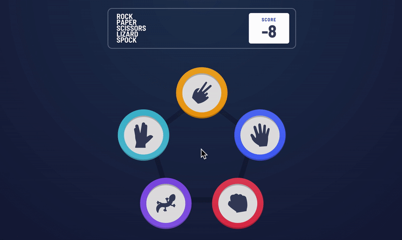
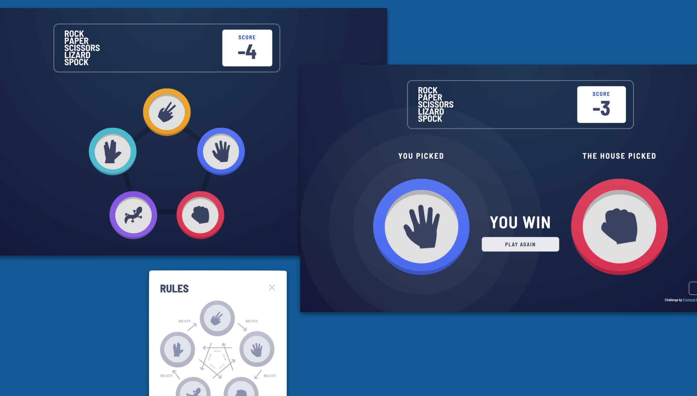
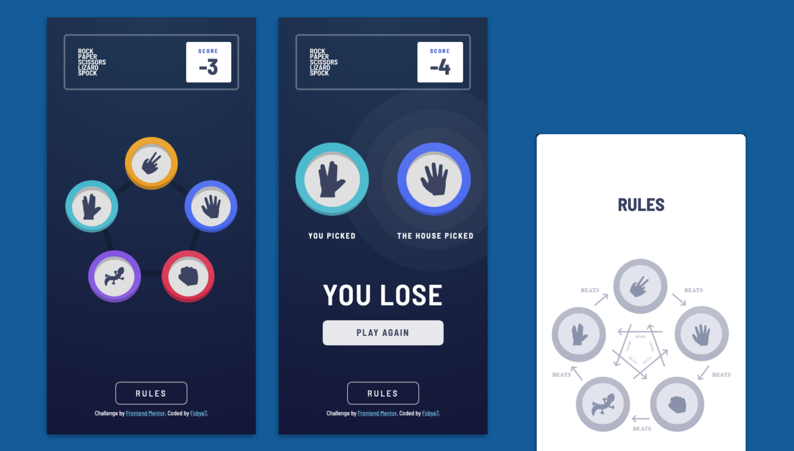
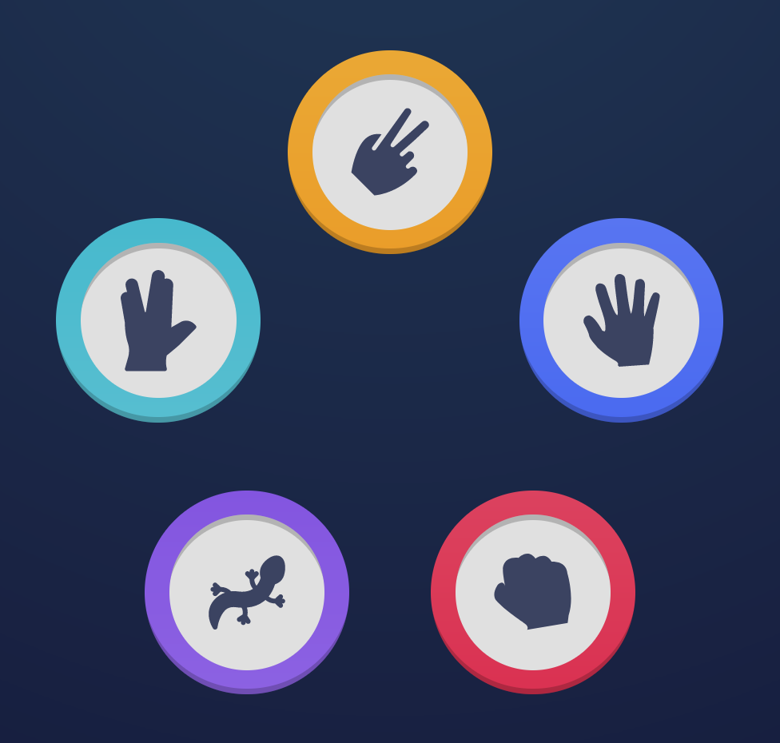
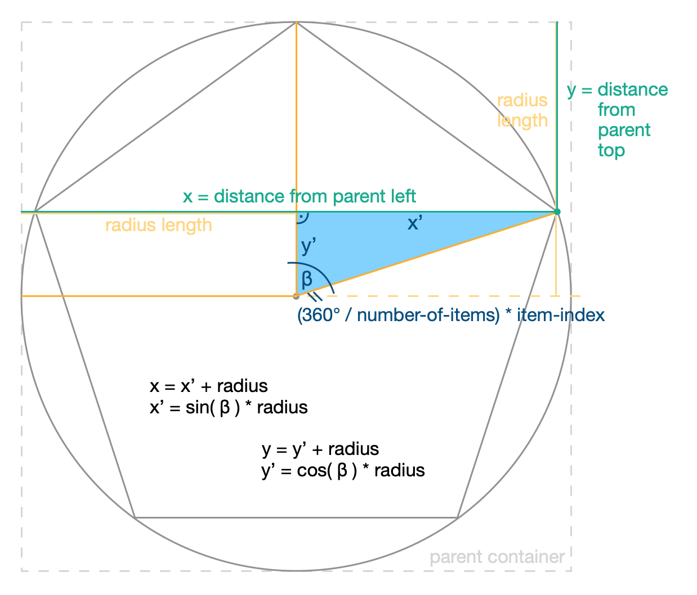
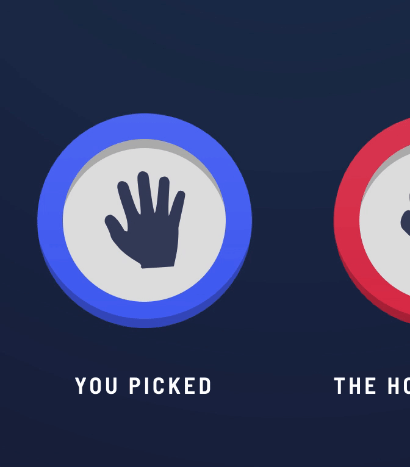

# Rock-Paper-Scissors Angular SPA with animation and SCSS styling

This is a solution to the [Rock, Paper, Scissors challenge on Frontend Mentor](https://www.frontendmentor.io/challenges/rock-paper-scissors-game-pTgwgvgH).

And woah, it was a journey! 35 hours of work across 3 and a half days. My second ever project in Angular too, so I was learning on the go a lot.

## Table of contents

- [Overview](#overview):
    - [Challange description](#the-challenge),
    - [Solution](#solution);

- [My process](#my-process):
    - [Built with](#built-with),
    - [What I learned](#what-i-learned),
    - [Continued development](#Continued-development),
    - [Showing off (my code)](#Showing-off-(my-code)). <-- worth checking out


## Overview

### The challenge

Users should be able to:

- View the optimal layout for the game depending on their device's screen size
- Play Rock, Paper, Scissors against the computer
- Maintain the state of the score after refreshing the browser _(optional)_
- **Bonus**: Play Rock, Paper, Scissors, Lizard, Spock against the computer _(optional)_

### Solution

Check it out live [here](https://fobya7.github.io/rock-paper-scissors/)!

Or the next best thing - this gif:

<div align="center"> </div>

| Desktop |
| --- |
|  |

| Mobile |
| --- |
|  |


## My process

### Built with

- Semantic HTML5 markup (using Flexbox)
- SCSS (using mixins, flow control, and media queries)
- [Angular](https://angular.io/) framework (using parametized animations, structural directives, and cookies)


### What I learned

Quite a lot.

- At first I dove deep into [radial gradients](https://developer.mozilla.org/en-US/docs/Web/CSS/gradient/radial-gradient) for the background.

#### Then I needed a lot info on Angular / TypeScript:

- like [event binding](https://angular.io/guide/event-binding),

- [passing functions between components](https://medium.com/@7hwyl/how-to-pass-a-function-to-a-child-component-in-angular-719fc3d1ee90),

- how to use an [ngSwitch](https://angular.io/api/common/NgSwitch),

- and an [equivalent to sleep / wait functions](https://stackoverflow.com/questions/37764665/how-to-implement-sleep-function-in-typescript),

- and [enums](https://dev.to/shane/working-with-enums-in-angular-html-templates-2io9), namely [iterating through a typescript enum](https://stackoverflow.com/questions/38554562/how-can-i-use-ngfor-to-iterate-over-typescript-enum-as-an-array-of-strings)
and [getting a random enum](https://stackoverflow.com/questions/44230998/how-to-get-a-random-enum-in-typescript),
tho i needed [official docs on the random function](https://developer.mozilla.org/en-US/docs/Web/JavaScript/Reference/Global_Objects/Math/random)
to fully comprehend the solution.

- [Cookies](https://stackoverflow.com/questions/34298133/angular-cookies) for the persisting score.

- Also - this neat JS / TS trick with [turning strings into numbers](https://stackoverflow.com/questions/14667713/how-to-convert-a-string-to-number-in-typescript).

#### And then there was SCSS Styling;

- working on [the inset button shadows](https://stackoverflow.com/questions/27212782/box-shadow-circle), which led me to learning in detail about [box shadows](https://developer.mozilla.org/en-US/docs/Web/CSS/box-shadow),

- [passing variables to scss](https://www.intertech.com/using-css-variables-in-angular/),

- [Sass ifs and mixins](https://sass-lang.com/documentation/at-rules/control/if),

- then Sass flow control; which I learned from [docs](https://sass-lang.com/documentation/at-rules/control), but this [tutorial](https://www.gavsblog.com/blog/for-each-while-loops-sass-scss) made it click,

- and - [class variables](https://stackoverflow.com/questions/41861319/angular2-set-css-class-to-component-variable-value).

I finished up the project with some animations;

- I learned the basics from [docs](https://angular.io/guide/animations) along with this [additional guidance](https://indepth.dev/posts/1285/in-depth-guide-into-animations-in-angular),

- fixed animations not applying, after [learning about elements leaving the DOM](https://stackoverflow.com/a/36417971/12731017).

- Made some animations [loop](https://stackoverflow.com/questions/47396509/repeat-animation-angular-4), and some of them [parameterized](https://stackoverflow.com/questions/50806212/how-to-use-input-parameters-in-angular-6-animation).

### Continued development

- I would love to deepen my knowlage on Angular animations and Sass mixins.

- And then there is the process itself. Two days into work I had an epiphany. From 'this SPA is an actual product' perspective, it would be better, if I worked on it in stages rather than hoping from one detail to another.

### Showing off (my code)

That said, here are parts of the code, that I'm really proud of:

-   **Handsigns** (with color-coordinated borders) have their own 
    component. Which handsign that component shows depends on it's scss class, and that can be made into a variable.

    ```html
    <handsign [handsign]="player_handsign"></handsign>
    ```

    ```ts
    /* ... */
    export class MatchComponent
    {
        @Input() player_handsign = Handsign.Rock;
        /* ... */
    }
    ```

    And this is how it looks on the inside. Those two mixins do all the heavy lifting. (I made the handsign icon a backgroud image, so it could be refrenced from CSS).

    ``` scss
    @mixin handsign-icon( $handsign )
    {
        /* ... */

            @if
        $handsign == rock { 
            background-image: url(../../../assets/icon-rock.svg);
            } @else if 
        $handsign == paper { /* etc */
    }

    @mixin handsign( $handsign )
    {
        /* ... */
    
        & .icon { @include handsign-icon( $handsign ); }

        @if
        $handsign == rock {
            background-image: linear-gradient(
                colors.$rock-gradient-light,
                colors.$rock-gradient-dark
                );
            } @else if
        $handsign == paper { /* etc */
    }
    ```

    And that's how you get those beauties!:

    

-   **Circular arrangment** was achieved by the power of math. It's reusable too, since you can just put in different numbers, and have for example, just three items. And maybe a little bit closer together.

    <table>
     <tr>
      <td width="50%">  </td>
      <td width="50%">  </td>
     </tr>
    </table>

    Math behind it looks like this:

    <div align="center"> </div>

    And code is just:

    ``` scss
    @mixin arrange-in-circle( $radius, $items-count, $item-index, $item-radius )
    {
        position: absolute;
        margin: -$item-radius;
        height: 2*$item-radius;
        width: 2*$item-radius;

        $angle: calc( 360deg / $items-count * ($item-index - 1) );
        top: $radius * math.cos( 180deg - $angle ) + $radius;
        left: $radius * math.sin( 180deg - $angle ) + $radius;
    }

    .circle-container
    {
        /* ... */
        position: relative;
        aspect-ratio: 1;

        @for $i from 1 through 5 { .circle-item-#{$i}
        {
            @include arrange-in-circle( 50%, 5, $i, 21% );
        } }
    }
    ```

- **Game 'loop'** is just a series of lambda functions. (Variables they change affect gui.)

    After player makes a choice, this function executes, starting a domino effect.

    ``` ts
    onChoice = (handsign : Handsign) =>
    {
        this.main_screen = MainScreenStates.Match
        this.player_handsign = handsign;
        setTimeout(() => { this.onHousePicked() }, 500);
    }
    ```

    500ms later we get:

    ``` ts
    onHousePicked = () =>
    {
        this.house_handsign = Object.values( Handsign )
            [Math.floor(Math.random() * Object.values( Handsign ).length )];
        this.has_house_picked = true;
        setTimeout(() => { this.onMatchEnd() }, 500);
    }
    ```

    And after 500ms more:

    ``` ts
    onMatchEnd = () =>
    {
        this.calculateMatchResult();
        this.has_match_ended = true;
    }
    ```

- **Animations** were fun to figure out. This code is for the rings that appear around winning handsign:

    ```html
    <div class="circle"
        [@circleAnimation] = "{
            value: animationState,
            params: { expanded:'42%', contracted:'40%' }
            }"
        (@circleAnimation.done) = "onAnimationDone()"
    ></div>
    <!-- and two more, with different expanded/contracted params-->
    ```

    ```ts
    export enum CircleState { Expanded = 'expanded', Contracted = 'contracted' }

    const stateExpanded = state
    (
        CircleState.Expanded,
        style( {
            width: 'calc( 100% + {{ expanded }} )',
            height: 'calc( 100% + {{ expanded }} )',
            margin: 'calc( -{{ expanded }} / 2 )'
            } ),
        { params: {
            expanded: '100px'
            } }
    );
    const stateContracted = state
    (
        CircleState.Contracted,
        style( {
            width: 'calc( 100% + {{ contracted }} )',
            height: 'calc( 100% + {{ contracted }} )',
            margin: 'calc( -{{ contracted }} / 2 )'
            } ),
        { params: {
            contracted: '50px'
            } }
    );

    export const circleAnimation = trigger( 'circleAnimation', 
    [
        stateExpanded,
        stateContracted,

        transition( ':enter', [
            style( { width: '100%', height: '100%' } ),
            animate( '1s' )
            ] ),
        transition( '* <=> *', animate( '1s' ) )
    ] );
    ```

    ```ts
    /* ... */
    export class WinnerCirclesComponent
    {
        animationState : CircleState = CircleState.Contracted;

        onAnimationDone = () =>
        {
            if( this.animationState === CircleState.Contracted )
                { this.animationState = CircleState.Expanded; }
            else
                { this.animationState = CircleState.Contracted; }
        }
    }
    ```

    And the effect is: (The rings first expand and then slightly pulsate.)

    <div align="center"> </div>

<br>

**I loved working on this project, and I hope it shows. Thanks for reading all the way through! :)**